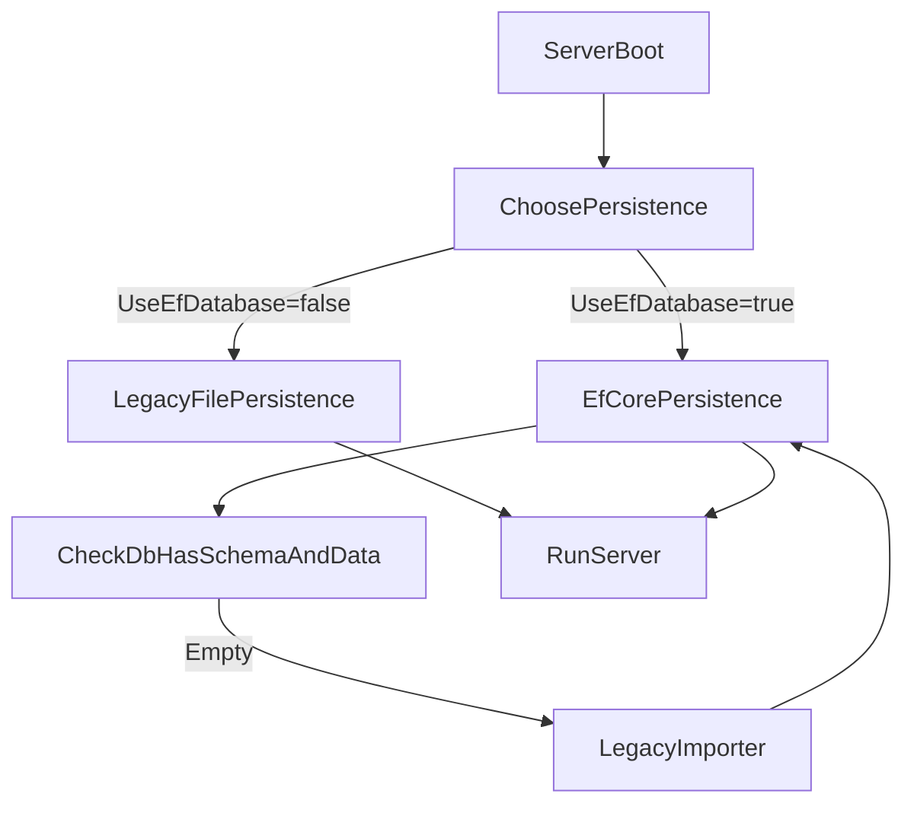

# EF Core migration plan (MirDatabase ➜ SQLite + Migrations)

## Goals

- Replace the current binary persistence in [`Server/MirEnvir/Envir.cs`](c:/Users/mikep/OneDrive/Bureaublad/Revamped/V2/Crystal/Server/MirEnvir/Envir.cs) (e.g. `Server.MirDB`, `Server.MirADB`, `*.mgd`, `*.mcd`, goods files) with **EF Core + SQLite**.
- Treat the **current persisted model (v116 / custom 0)** as the **baseline schema** and generate that as the **InitialCreate** migration.
- Provide a **one-time import** path that reads the existing files using the current readers and writes rows to the new DB.
- Keep a **feature-flagged rollback** to legacy file persistence until the new path is proven stable.

## What we have today (persistence map)

- **Server DB (static-ish)**: written by `SaveDB()` to `./Server.MirDB` (maps, items, monsters, NPCs, quests, magic, gameshop, conquests, respawn, GT maps).
- **User DB (accounts + global counters + auctions + gameshop log + respawn saves)**: written by `SaveAccounts()` to `./Server.MirADB`.
- **Guilds**: `./Guilds/*.mgd` (plus temp `*.mgdn` swap).
- **Conquests**: `./Conquests/*.mcd` (plus temp `*.mcdn` swap).
- **Goods**: `./Envir/Goods/*.msd`-style files (see `SaveGoods`).

Key domain shapes to mirror:

- `AccountInfo` / `CharacterInfo` in [`Server/MirDatabase`](c:/Users/mikep/OneDrive/Bureaublad/Revamped/V2/Crystal/Server/MirDatabase/) use `Index` identifiers and contain nested collections/arrays (characters, storage, inventory, equipment, mail, auctions, etc.).
- `UserItem` (in [`Shared/Data/ItemData.cs`](c:/Users/mikep/OneDrive/Bureaublad/Revamped/V2/Crystal/Shared/Data/ItemData.cs)) is a recursive structure (`Slots` of `UserItem`) and is referenced from storage/inventory/mail/auction/etc.

## Target architecture

### 1) New persistence layer (EF Core)

- Add a new folder/assembly (recommended): `Server/Database/`
  - `Mir2DbContext`
  - `Entities/` (pure POCO persistence models)
  - `Migrations/`
- Keep existing runtime domain models (`AccountInfo`, `CharacterInfo`, etc.) intact initially.
- Introduce a persistence abstraction:
  - `IMirPersistence` (load/save operations used by `Envir`)
  - `LegacyFilePersistence` (wraps existing file logic)
  - `EfCorePersistence` (backed by `Mir2DbContext`)

### 2) Normalized relational schema (SQLite)

Use current `Index`/IDs as primary keys to keep compatibility and simplify binding.

Core tables (high-level):

- **Meta**: `DbMeta` row storing `Version`, `CustomVersion`, `NextAccountID`, `NextCharacterID`, `NextGuildID`, `NextHeroID`, `NextUserItemID`, `NextAuctionID`, `NextMailID`, `NextRecipeID`.
- **Accounts**: `Accounts(Index PK, AccountID UNIQUE, PasswordHash, Salt, ... )`
- **Characters**: `Characters(Index PK, AccountIndex FK, GuildIndex FK nullable, ... location, stats, flags, etc.)`
- **UserItems**: `UserItems(UniqueID PK, ItemIndex FK, dura, count, flags, expire/rental/sealed, stats, ... )`
- **Item containment**:
  - `ItemLocations(OwnerType, OwnerId, ContainerType, SlotIndex, UserItemId FK)` for Inventory/Equipment/QuestInventory/Storage/etc.
  - `UserItemSlots(ParentUserItemId FK, SlotIndex, ChildUserItemId FK)` for socketed/contained items.
- **Auctions**: `Auctions(AuctionId PK, SellerCharacterIndex FK, BuyerCharacterIndex FK nullable, UserItemId FK, ... )`
- **Mail**: `Mail(MailId PK, RecipientCharacterIndex FK, SenderCharacterIndex nullable, ... )` + `MailItems`/`MailUserItems` as needed.
- **Guilds**: `Guilds(Index PK, ...)` + `GuildRanks`, `GuildMembers`, `GuildStoredItems`, `GuildBuffs`.
- **Conquests**: `Conquests(Index PK, ConquestInfoIndex FK, ...)` + normalized child tables mirroring `ConquestGuildInfo` graphs.
- **Server/static DB** (optional but recommended for “complete” migration): tables mirroring what `SaveDB()` writes: `MapInfos`, `ItemInfos`, `MonsterInfos`, `NpcInfos`, `QuestInfos`, `MagicInfos`, `GameShopItems`, `ConquestInfos`, `RespawnTimerState`, `GtMaps`.

SQLite type notes:

- `ulong` IDs (`UserItem.UniqueID`, `AuctionID`, `MailID`) should be stored safely. With SQLite’s signed 64-bit integer, we’ll either:
  - store as `INTEGER` with an EF `ValueConverter<ulong,long>` and guard against overflow, or
  - store as `TEXT` with a converter (safer for full `ulong` range, slightly heavier).

The plan will pick one consistently and use it across PK/FK columns.

### 3) Import strategy (legacy ➜ EF)

- Build a one-time import routine that:
  - uses current readers (`LoadDB()`, `LoadAccounts()`, `LoadGuilds()`, `LoadConquests()`, goods load) to materialize today’s in-memory objects
  - maps them into EF entities
  - saves them into SQLite in deterministic order (to satisfy FKs): meta → static DB → accounts → characters → items → item locations/slots → auctions → mail → guilds → conquests → goods.
- Keep the legacy files untouched (import is read-only).

### 4) Cutover strategy

- Add a setting (e.g. in [`Server/Settings.cs`](c:/Users/mikep/OneDrive/Bureaublad/Revamped/V2/Crystal/Server/Settings.cs) / `Setup.ini`) like `UseEfDatabase=true` and `ConnectionString=Data Source=mir2.db`.
- On startup:
  - if `UseEfDatabase=false`: use legacy file persistence (current behavior)
  - if `UseEfDatabase=true` and DB empty: run importer then start
  - if `UseEfDatabase=true` and DB exists: load from EF

## Data flow (new world)

## Implementation checklist (what we’ll actually do)

- Add EF Core packages to the server library (SQLite provider + design-time tooling).
- Create `Mir2DbContext` and all entity configurations (prefer Fluent API + separate `IEntityTypeConfiguration<T>` classes).
- Generate **InitialCreate** migration representing the modeled schema.
- Implement importer + progress logging (counts for each table).
- Implement `EfCorePersistence` load/save paths and wire into `Envir` behind a flag.
- Add verification tooling:
  - “counts parity” checks (e.g. #accounts, #characters, #guilds, #auctions)
  - sample spot-check dumps (one account with items, one guild, one conquest)

## Key files we’ll touch

- [`Server/MirEnvir/Envir.cs`](c:/Users/mikep/OneDrive/Bureaublad/Revamped/V2/Crystal/Server/MirEnvir/Envir.cs): route persistence through an interface; keep old methods for importer.
- New: `Server/Database/Mir2DbContext.cs`, `Server/Database/Entities/*`, `Server/Database/Migrations/*`.
- [`Server/Settings.cs`](c:/Users/mikep/OneDrive/Bureaublad/Revamped/V2/Crystal/Server/Settings.cs): config flag + connection string.

## Risks & mitigations

- **Schema size/complexity** (fully normalized): implement in layers (core first), keep migrations small/iterative after initial baseline.
- **Recursive `UserItem.Slots`**: model via `UserItemSlots` (self-referencing) and import depth-first.
- **Performance**: use bulk-ish patterns (batched `SaveChanges`, `AutoDetectChangesEnabled=false` during import) and indexes on common lookups (`AccountID`, `Character.Name`, FK columns).
- **Behavioral differences** (lazy loading, tracking): keep EF usage explicit; no long-lived context.